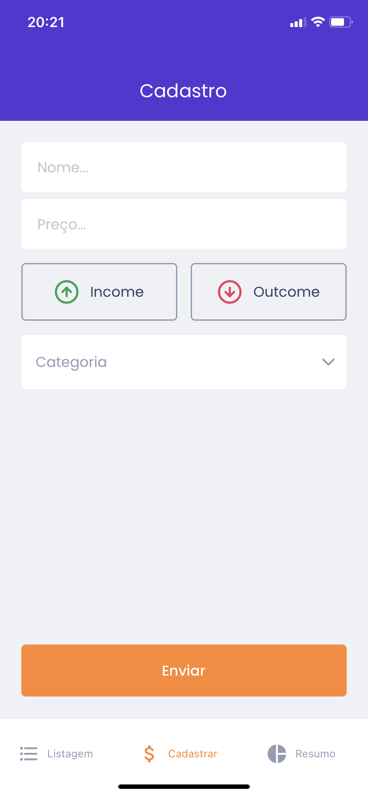
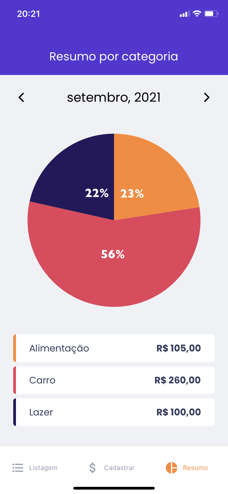

<h1 align=center>
  
</h2>

<h3 align=center>
  Gerencie suas transações de maneira inteligente
</h3>

<h2>Preview do projeto 🚀</h2>

<div align=center>
  
  
  
  
</div>


<h2>Sobre 🕵️</h2>

<p>O gofinances é uma ótima alternativa para acompanhamento de transações financeiras. Ele fornece uma descrição dos registros criados e  um balanço dos valores, para você, de forma simples e elegante.<p>

<h2>Tecnologias utilizadas 🤯</h2>

<ul>
  <li><a href="https://www.typescriptlang.org/">TypeScript</a></li>
  <li><a href="https://reactnative.dev/">React Native</a></li>
  <li><a href="https://styled-components.com/docs/basics">Styled-components</a></li>
  <li><a href="https://reactnavigation.org/">React-Navigation</a></li>
</ul>

<h2>Requisitos de software 🔍</h2>

<li><a href="https://yarnpkg.com/">Instalar o yarn</a></li>
<li><a href="https://react-native.rocketseat.dev/">Instalar e configurar o Android Studio (opcional)</a></li>

<h2><strike>Não</strike> Tente isso em casa! ⚠️</h2>

<p>Para rodar o projeto, basta executar os seguintes comandos, em seu terminal com git</p>

```bash
  # Faça um clone do repositório

  git clone <link-do-repositório>

  # Navegue até a pasta do projeto e baixe as dependências

  cd GoFinances-mobile && yarn

  # Rode o metro bundler

  yarn start

  # E, em outro terminal, execute

  yarn android # ou yarn ios
```

<p><em>Obs: É muito importante que o back-end esteja rodando, quando você inciar o app</em></p>

<h2>Como contribuir? 😍</h2>

<p>Além de marcar o repositório com uma ⭐, para aumentar sua visibilidade, você pode fazer um fork do projeto, executar os passos anteriores, e</p>

```bash
# Dentro da pasta do seu fork, crie uma branch para fazer as alterações

git checkout -b <sua-branch>

# Faça suas alterações
# ...

# Faça um commit do que foi feito

git add .
git commit -m 'conte o que você fez'

# Faça o push do que foi feito

git push origin <sua-branch>
```

<h2>📝 Licença</h2>
Esse projeto se encontra sob a licença <strong>MIT</strong>. Para mais informações, acesse o arquivo <strong>LICENSE</strong>.

<hr>
<p align=center>Made with 💜 by <a href="https://www.linkedin.com/in/leonardo-brizolla/?locale=pt_BR/">Leonardo Brizolla</a><p>
